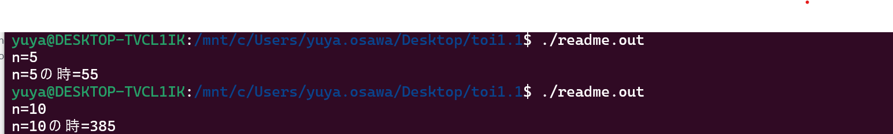

## 説明
scanfでnの値を入力し、計算値を出るようにした。

#include <stdio.h>
#include "sum11.h"

int calc(int k);

int main()
{
    int n,k,sum;

    printf("n=");
    scanf("%d",&n);

    sum=calc(n);

    printf("n=%dの時=%d\n",n,sum);

    return 0;
}